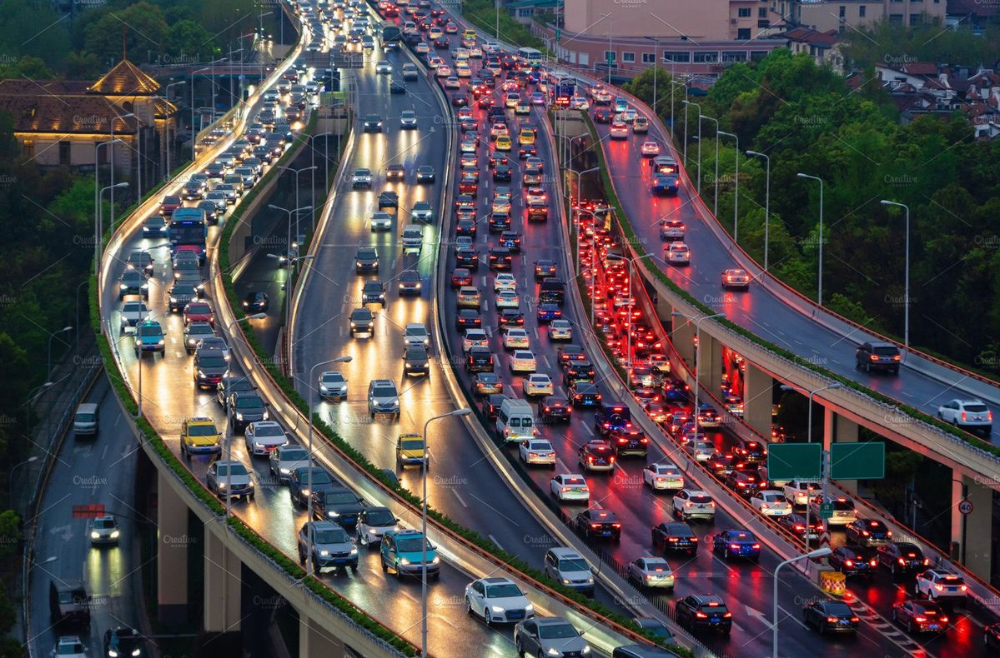

# 9103_tut1_groupF
## Individual part_jxia0576_Juncheng Xiang_SID:550514046
### Instructions
User's mouse drag (or motion-sensing gesture) directly drives the dynamic flow of the Mondrian city grid. 
#### Driving Section
I am primarily responsible for the Group PPT and the foundational interactive components of the project.
#### Animation Effects
During rapid dragging, colour blocks within the grid dart about like a stream of traffic; when moved slowly, they glide with leisurely grace, allowing the user's rhythm of motion to shape the visual composition.
#### References Inspiration

My inspiration mainly comes from this picture, which inspires me to think: Can users be allowed to control the flow of “virtual traffic” in a grid-based cityscape? When the blocks move like vehicles at different speeds, leaving glowing trails as they shuttle, the artwork will vividly convey the rhythm of urban life and the interaction between human action and city dynamics, creating a dynamic visual experience that blends order and spontaneity.（here is the image's come-from Link: https://www.pinterest.com/pin/147211481560488923/)
##### Technical explanation
I added interaction-related variables such as lastMouseX, lastMouseY, and dragSpeed to track mouse movement. In the draw() function, when the user presses the mouse (drags), the horizontal (dx) and vertical (dy) displacement differences between the current and previous mouse positions are calculated, and dragSpeed is derived using the distance formula, scaled by SPEED_FACTOR to control sensitivity. When the mouse is released, dragSpeed gradually decays by multiplying with 0.95 each frame to create a smooth slowdown effect.

In the GridLine class's update() method, the movement of cubes is linked to dragSpeed: each cube's base speed is multiplied by (1 + dragSpeed) to achieve speed adjustment based on drag intensity—faster drags result in faster cube movement, while slower drags lead to slower sliding. Additionally, direction control is implemented: for vertical grid lines, if the mouse moves upward (mouseY < pmouseY), the cube's movement direction reverses; for horizontal grid lines, if the mouse moves leftward (mouseX < pmouseX), the direction also reverses, making the cubes' flow align with the user's drag trajectory.
